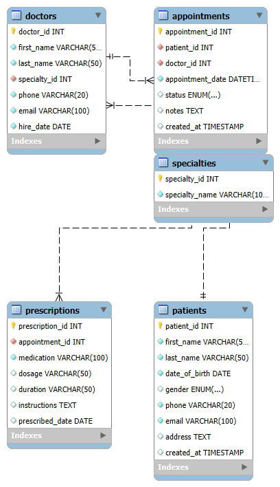

# Clinic Booking System Database 🏥

A complete relational database system for managing clinic operations including patient records, doctor appointments, and prescription tracking.

## Features ✨
- Patient information management
- Doctor specialty tracking
- Appointment scheduling (scheduled/completed/canceled statuses)
- Prescription management
- Data integrity enforcement through constraints
- Sample dataset for demonstration

## Database Structure 🗄️
**Tables:**
1. `specialties` - Medical specialties (Cardiology, Pediatrics, etc.)
2. `patients` - Patient demographic and contact information
3. `doctors` - Doctor details with specialty relationships
4. `appointments` - Booking system with status tracking
5. `prescriptions` - Medication records linked to appointments

## ERD Diagram


## Setup Instructions ⚙️

### Requirements
- MySQL Server (8.0+ recommended)
- MySQL Client/Workbench

### Installation
1. Create new database:
   ```sql
   CREATE DATABASE clinic_db;
   USE clinic_db;
